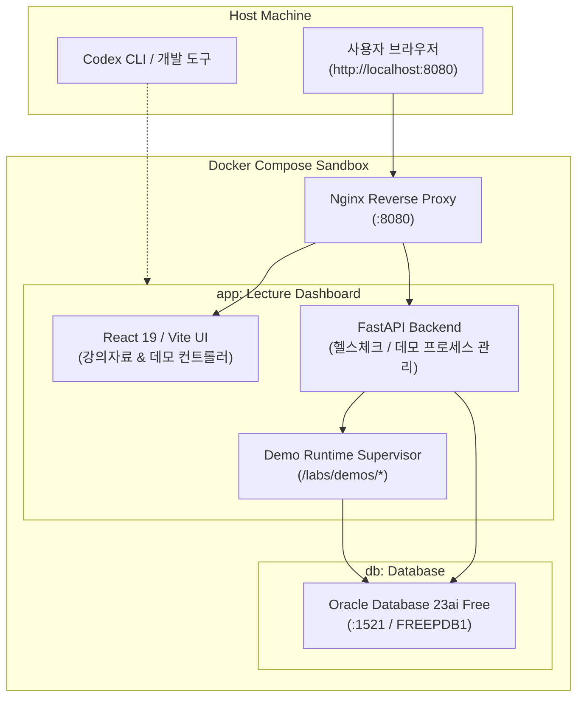

# AI Lecture & Self-Demo Environment 🎓🤖

[](compose.yaml)
[](infra/db)
[](backend)
[](frontend)
[](env)

**AI Lecture Environment**는 생성형 AI(RAG, 프롬프트 엔지니어링, 에이전트) 및 최신 데이터베이스(Oracle 23ai) 실습을 컨테이너 기반으로 즉시 구동하고, 코딩 에이전트(Codex)와 함께 인터랙티브하게 학습할 수 있는 **올인원 셀프 데모·교육 플랫폼**입니다.

---

## 🌟 핵심 특징 (Key Highlights)

1. **원클릭 풀스택 실습 샌드박스**
   - Oracle DB 23ai Free, FastAPI 백엔드, React 웹 대시보드가 Docker Compose로 한 번에 구동됩니다.
2. **동적 셀프 데모 런타임 (Dynamic Demo Runtime)**
   - 수강생이 생성한 구현물은 `/labs/demos/[과정명]`에 독립된 환경으로 격리되며, Supervisor 데몬을 통해 동적으로 start/stop 라이프사이클을 제어합니다.
3. **체계적인 실습 커리큘럼 내장**
   - **Course 01: [Simple RAG](courses/01-simple-rag/README.md)** — 사내 규정 검색, 출처 인용, OpenAI 답변 생성 및 벡터 검색 파이프라인.
4. **신규 강의 템플릿 스캐폴딩**
   - `scripts/new-course.sh` CLI를 통해 가이드, 시나리오, 검증 체크리스트가 포함된 새 코스를 즉시 생성할 수 있습니다.
5. **멀티 아키텍처 네이티브 지원**
   - Apple Silicon (macOS arm64) 및 Windows/Linux (x86_64 amd64)에 최적화된 사전 구성 환경 파일(`env/*.env`) 제공.

---

## 🏗️ 시스템 아키텍처 (Architecture)



---

## 🚀 빠른 시작 (Quick Start)

### 1. 요구사항
- Docker Desktop 또는 OrbStack (Compose v2 지원)
- 호스트에 OpenAI / Codex CLI 인증 완료 (`~/.codex/auth.json`)

### 2. 저장소 복제 및 환경 설정
```bash
git clone https://github.com/dontotl/ai-lecture-environment.git
cd ai-lecture-environment

# 환경 파일 복사 (.env의 DB 비밀번호 수정 권장)
cp .env.example .env
```

### 3. 컨테이너 빌드 및 구동

* **macOS (Apple Silicon M1/M2/M3/M4)**:
  ```bash
  docker compose --env-file env/macos-arm64.env up --build -d
  ./scripts/verify-compose.sh env/macos-arm64.env
  ```

* **Windows / Linux (Intel/AMD x64)**:
  ```bash
  docker compose --env-file env/windows-amd64.env up --build -d
  ./scripts/verify-compose.sh env/windows-amd64.env
  ```

### 4. 접속 확인
- 🌐 **대시보드 UI**: [http://localhost:8080](http://localhost:8080)
- 🏥 **API 헬스체크**: [http://localhost:8080/api/health](http://localhost:8080/api/health)

---

## 📚 강의 및 실습 진행 방법

### Step 1: 강의 머티리얼 마운트
호스트에서 제공되는 실습 패키지를 샌드박스로 전송합니다:
```bash
docker compose --env-file env/macos-arm64.env cp courses/01-simple-rag app:/labs/materials/01-simple-rag
```

### Step 2: Codex 에이전트와 구현 진행
```bash
# 샌드박스 내부 접속 후 실습 진행
docker compose exec app bash
cd /labs/demos/simple-rag
```
`courses/01-simple-rag/AGENTS.md` 지침에 따라 AI 에이전트에게 RAG 파이프라인 구현 지시를 내립니다.

### Step 3: 웹 대시보드에서 동작 확인
브라우저(`http://localhost:8080`)의 Simple RAG 탭에서 실시간 질의응답 및 벡터 검색 결과를 확인합니다.

---

## 🛠️ 신규 코스 생성 (Course Scaffolding)

새로운 AI 실습 커리큘럼을 손쉽게 추가할 수 있습니다:

```bash
./scripts/new-course.sh 02-agentic-workflow "Autonomous Agentic Workflow"
```
실행 시 표준 디렉토리 구조(`guides/`, `knowledge/`, `scenarios/`, `checks/`, `AGENTS.md`)가 자동으로 템플릿화되어 생성됩니다.

---

## 📂 디렉토리 구조

```text
ai-lecture-environment/
├── compose.yaml               # 멀티 컨테이너 오케스트레이션
├── env/                       # 플랫폼별 환경설정 (macOS, Windows)
├── infra/                     # Dockerfile & 인프라 설정
│   ├── app/                   # FastAPI + Vite + Supervisor 컨테이너
│   ├── db/                    # Oracle DB 23ai 컨테이너
│   └── nginx/                 # 리버스 프록시 설정
├── frontend/                  # React 19 웹 대시보드
├── backend/                   # FastAPI 데모 관리 백엔드
├── courses/                   # 강의 실습 자료집
│   ├── 01-simple-rag/         # Simple RAG 코스웨어
│   └── _template/             # 신규 코스용 템플릿
├── docs/                      # 아키텍처 및 런타임 규약 문서
└── scripts/                   # 검증 및 유틸리티 쉘 스크립트
```

---

## 📄 라이선스 (License)

본 프로젝트는 [MIT License](LICENSE)를 따릅니다.
